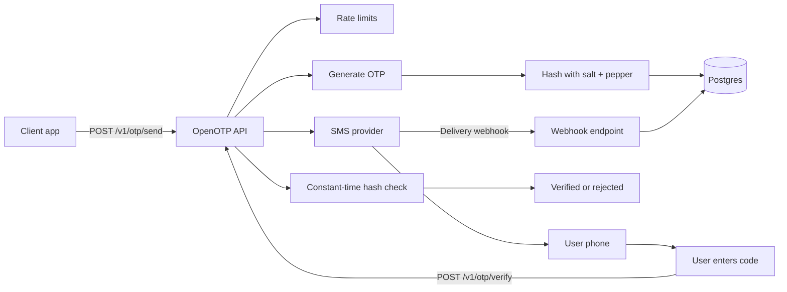

# OpenOTP

[](https://www.python.org/)
[](https://fastapi.tiangolo.com/)
[](https://www.postgresql.org/)
[](https://redis.io/)
[](https://docs.docker.com/compose/)
[](LICENSE)

OpenOTP is a self-hosted SMS OTP backend for teams that want to own verification state instead of outsourcing it to an SMS vendor.

It generates OTPs in your app, stores only salted and peppered hashes, enforces expiry and rate limits, records audit logs, and treats Twilio as a delivery channel rather than the source of truth.

```text
Your app owns the verification logic.
The SMS provider only delivers the message.
```

## Contents

- [Why OpenOTP](#why-openotp)
- [How It Works](#how-it-works)
- [Quick Start](#quick-start)
- [Production Deploy](#production-deploy)
- [API Examples](#api-examples)
- [Configuration](#configuration)
- [Security Model](#security-model)
- [Operations](#operations)
- [Development](#development)
- [Project Layout](#project-layout)
- [Documentation](#documentation)
- [Contributing](#contributing)

## Why OpenOTP

OpenOTP is useful when you want:

- Control over OTP generation, hashing, expiry, attempts, lockouts, and audit logs.
- A small service you can read, deploy, and reason about.
- Redis-backed rate limiting with a database fallback.
- Twilio delivery without Twilio owning your OTP lifecycle.
- Docker Compose for local development and single-host production.
- Prometheus metrics, health checks, readiness checks, migrations, and cleanup jobs.
- Production guardrails that fail closed when unsafe defaults are used.

It is not trying to be a full identity platform. It is a focused OTP service you can put behind your own product, auth layer, or internal tooling.

## How It Works



OpenOTP stores:

- normalized phone number
- purpose
- OTP hash and salt
- status, expiry, attempt count, resend count
- delivery provider reference
- audit events

OpenOTP does not store plaintext OTP codes.

## Status

OpenOTP is a production-minded MVP and reference implementation. It is suitable for local demos, internal tools, technical interviews, architecture review, and as a foundation for a real service.

Before high-volume or high-risk production use, add your organization’s abuse controls, alerting, backup policy, and deployment review process.

## Quick Start

Run the local stack:

```bash
cp examples/env/.env.example .env
docker compose -f deploy/compose/docker-compose.yml up --build
```

Open the docs UI:

```text
http://127.0.0.1:8000/docs
```

Check the service:

```bash
curl http://127.0.0.1:8000/health
curl http://127.0.0.1:8000/ready
```

The local stack uses:

| Service | Address |
| --- | --- |
| API | `127.0.0.1:8000` |
| Postgres | `127.0.0.1:5432` |
| Redis | `127.0.0.1:6379` |
| SMS provider | `console` |

Stop it:

```bash
docker compose -f deploy/compose/docker-compose.yml down
```

## Production Deploy

Generate a production env file:

```bash
./scripts/init-env.sh
```

The script creates `.env.production`, generates secrets, and prints the API key your client apps should use.

Review:

```env
OPENOTP_DOMAIN=otp.example.com
OTP_PUBLIC_BASE_URL=https://otp.example.com
OTP_ALLOWED_COUNTRIES=US,CA
OTP_TWILIO_ACCOUNT_SID=...
OTP_TWILIO_AUTH_TOKEN=...
OTP_TWILIO_FROM_NUMBER=+15557654321
```

Start the production stack:

```bash
docker compose -f deploy/compose/docker-compose.prod.yml --env-file .env.production up -d --build
```

Production includes:

- Caddy with automatic HTTPS
- OpenOTP API
- Postgres
- Redis
- persistent Docker volumes

See [docs/deploy.md](docs/deploy.md) for backups, health checks, upgrades, and metrics.

## API Examples

If `OTP_API_KEY` is configured, include it:

```text
X-OpenOTP-API-Key: <your-api-key>
```

### Send OTP

```bash
curl -X POST http://127.0.0.1:8000/v1/otp/send \
  -H "Content-Type: application/json" \
  -H "X-OpenOTP-API-Key: $OTP_API_KEY" \
  -d '{"phone_number":"+14155552671","purpose":"login"}'
```

```json
{
  "success": true,
  "message": "OTP sent successfully.",
  "challenge_id": "uuid",
  "expires_at": "2026-04-21T20:00:00"
}
```

### Verify OTP

```bash
curl -X POST http://127.0.0.1:8000/v1/otp/verify \
  -H "Content-Type: application/json" \
  -H "X-OpenOTP-API-Key: $OTP_API_KEY" \
  -d '{"phone_number":"+14155552671","purpose":"login","code":"123456"}'
```

```json
{
  "success": true,
  "message": "OTP verified successfully.",
  "challenge_id": "uuid",
  "expires_at": null
}
```

Invalid, missing, expired, blocked, and already-used OTP challenges all return a uniform verification failure.

## Configuration

All application settings use the `OTP_` prefix.

| Variable | Purpose |
| --- | --- |
| `OTP_APP_ENV` | Use `production` to enable production startup checks. |
| `OTP_API_KEY` | Optional in development, required in production. |
| `OTP_OTP_PEPPER` | Secret pepper used when hashing OTPs. Must be changed in production. |
| `OTP_SMS_PROVIDER` | `console` for local development, `twilio` for real SMS. |
| `OTP_PUBLIC_BASE_URL` | Public HTTPS base URL used for SMS status callbacks. |
| `OTP_REDIS_URL` | Enables Redis-backed rate limiting when configured. |
| `OTP_RATE_LIMIT_BACKEND` | `redis` or `database`. |
| `OTP_ALLOWED_COUNTRIES` | Optional comma-separated ISO country allow-list, such as `US,CA,GB`. |
| `OTP_TRUSTED_PROXY_IPS` | Comma-separated trusted proxy IPs or CIDRs for forwarded headers. |
| `OTP_METRICS_BEARER_TOKEN` | Protects `/metrics` with bearer auth when set. |

Production startup rejects:

- default OTP pepper
- console SMS provider
- missing API key
- non-HTTPS public base URL
- unauthenticated metrics when metrics are enabled

## Security Model

OpenOTP follows these rules:

| Control | Behavior |
| --- | --- |
| OTP generation | Uses Python `secrets`. |
| OTP storage | Stores salted, peppered hashes only. |
| Verification | Uses constant-time comparison. |
| Expiry | Server-enforced TTL. |
| Attempts | Server-enforced max verification attempts. |
| Resends | Cooldown and max resend policy. |
| Rate limits | Per phone and per client IP. |
| Forwarded headers | Trusted only from configured proxy IPs or CIDRs. |
| Metrics | Private or bearer-protected. |
| Errors | Verification failures avoid precise state leakage. |

SMS OTP is useful, but it is not phishing-resistant. For high-assurance authentication, pair OpenOTP with stronger factors and account-risk controls.

## Endpoints

| Method | Path | Purpose |
| --- | --- | --- |
| `POST` | `/v1/otp/send` | Create or resend an OTP challenge. |
| `POST` | `/v1/otp/verify` | Verify an OTP code. |
| `POST` | `/v1/webhooks/sms/{provider}/status` | Receive provider delivery status callbacks. |
| `GET` | `/health` | Process liveness. |
| `GET` | `/ready` | Database and Redis readiness. |
| `GET` | `/metrics` | Prometheus metrics. |

## Operations

Health:

```bash
curl https://otp.example.com/health
curl https://otp.example.com/ready
```

Metrics:

```bash
curl https://otp.example.com/metrics \
  -H "Authorization: Bearer $OTP_METRICS_BEARER_TOKEN"
```

Backup:

```bash
docker exec openotp-postgres pg_dump -U openotp openotp > openotp-$(date +%F).sql
```

Upgrade:

```bash
git pull
docker compose -f deploy/compose/docker-compose.prod.yml --env-file .env.production up -d --build
```

## Development

Install locally:

```bash
python3 -m venv .venv
.venv/bin/pip install -e '.[dev]'
```

Run tests:

```bash
.venv/bin/pytest -q
```

Run security checks:

```bash
.venv/bin/pip install bandit pip-audit
.venv/bin/bandit -r app -ll
.venv/bin/pip-audit
```

Run with local containers:

```bash
docker compose -f deploy/compose/docker-compose.yml up -d postgres redis
.venv/bin/alembic upgrade head
.venv/bin/uvicorn app.main:app --reload
```

## Project Layout

```text
app/
  api/            HTTP routes and dependencies
  core/           settings and logging
  db/             SQLAlchemy engine and session setup
  models/         OTP challenge and audit log models
  observability/  metrics and middleware
  schemas/        request and response models
  services/       OTP logic, rate limiting, SMS, cleanup, webhooks
  utils/          phone normalization helpers
alembic/          database migrations
deploy/
  caddy/          production reverse proxy config
  compose/        local and production Docker Compose files
docker/           container entrypoint
docs/             architecture, API, deployment, operations, and security
examples/
  env/            local, Docker, Postgres, and production env templates
scripts/          maintenance and setup helpers
tests/            pytest coverage
```

## Documentation

- [Deployment](docs/deploy.md)
- [API](docs/api.md)
- [Architecture](docs/architecture.md)
- [Security](docs/security.md)
- [Operations](docs/operations.md)
- [Testing](docs/testing.md)

## Contributing

Issues and pull requests are welcome. Read [CONTRIBUTING.md](CONTRIBUTING.md), [CODE_OF_CONDUCT.md](CODE_OF_CONDUCT.md), and [SECURITY.md](SECURITY.md) before contributing.

## License

MIT. See [LICENSE](LICENSE).
